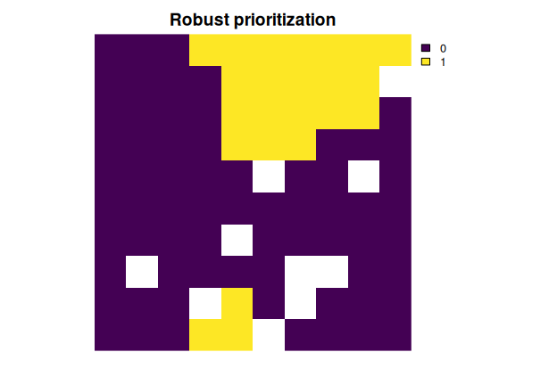

# robust.prioritizr 

# Robust Systematic Conservation Prioritization in R

<!-- badges: start -->

[](https://lifecycle.r-lib.org/articles/stages.html#stable)
[](https://github.com/frankiecho/robust.prioritizr/actions)
[](https://app.codecov.io/gh/frankiecho/robust.prioritizr/branch/master)
[](https://CRAN.R-project.org/package=robust.prioritizr)
<!-- badges: end -->

The *robust.prioritizr R* package provides robust optimization
techniques for systematic conservation prioritization. This is important
because conservation prioritizations typically only consider the most
likely prediction associated with a conservation action (e.g.,
establishing a protected area will safeguard a threatened species
population) and fail to consider alternative predictions where the
conservation prioritization could fail to meet its objectives. By
extending the *prioritizr R* package, this package can be used to
generate conservation prioritizations that account of uncertainty in the
climate change scenario projections, species distribution models,
ecosystem service models, and measurement errors. In particular,
prioritizations can be generated to be fully robust to uncertainty by
minimizing (or maximizing) objectives under the worst possible outcome.
Since reducing the associated with achieving conservation objectives may
sacrifice other objectives (e.g., minimizing protected area
implementation costs), or make a feasible conservation problem
infeasible, prioritizations can also be generated to be partially robust
based on a specified confidence level parameter. Partially robust
prioritizations can be generated based on the chance constrained
programming problem (Charnes & Cooper 1959, <doi:10.1287/mnsc.6.1.73>)
and the conditional value-at-risk problem (Rockafellar & Uryasev 2000,
<doi:10.21314/JOR.2000.038>). For more information, please see the video
below.

<div style="display: flex; justify-content: center;">

<iframe style="aspect-ratio: 16 / 9; width: 100% !important;" src="https://www.youtube.com/embed/Xbok5fLMsY0?si=QxZRWjKvFCTDTvbT" title="YouTube video player" frameborder="0" allow="accelerometer; autoplay; clipboard-write; encrypted-media; gyroscope; picture-in-picture; web-share" referrerpolicy="strict-origin-when-cross-origin" allowfullscreen></iframe>

</div>

## Installation

You can install the official version of the package from CRAN with the
following *R* code.

``` r
install.packages("robust.prioritizr")
```

Alternatively, you can install the development version from the online
code repository with the following *R* code.

``` r
if (!require(remotes)) install.packages("remotes")
remotes::install_github("frankiecho/robust.prioritizr")
```

## Example usage

Here is a short example showing to how to build a robust conservation
prioritization with the *robust.prioritizr* package. A conservation
prioritization involves a set of candidate places for management (termed
planning units) and a set of biodiversity elements (termed features),
such as species, ecosystems, or ecosystem services. To guide priority
setting, conservation prioritizations typically consider the most likely
outcome associated with implementing conservation management in a given
planning unit. For example, when considering protected area
establishment as a management option, conservation prioritizations
typically assume that establishing a protected area in a planning unit
will have a 100% chance of successfully protecting all the features that
are thought to inhabit the planning unit. However, this assumption may
lead to misplaced priorities if there is uncertainty in whether or not
features inhabit different planning units.

The package uses multiple alternative outcomes to explicitly account for
uncertainty. To achieve this, users should (i) input alternative
outcomes for each feature as separate feature into the prioritization
process, and (ii) specify which input features represent alternative
outcomes by grouping them together. For example, if there are 5
alternative outcomes for a particular species based on different climate
scenarios, then the data for these 5 scenarios should be input as
separate features and they should be assigned to the same feature group.
Below, we provide an example showing how to do this with some simulated
data.

``` r
# Load packages
library(robust.prioritizr)
library(prioritizr)
library(terra)
```

``` r
# Get planning unit data
pu <- get_sim_pu_raster()

# Get feature data
features <- get_sim_features()

# Preview data
print(pu)
```

    ## class       : SpatRaster 
    ## size        : 10, 10, 1  (nrow, ncol, nlyr)
    ## resolution  : 0.1, 0.1  (x, y)
    ## extent      : 0, 1, 0, 1  (xmin, xmax, ymin, ymax)
    ## coord. ref. : Undefined Cartesian SRS 
    ## source      : sim_pu_raster.tif 
    ## name        :    layer 
    ## min value   : 190.1328 
    ## max value   : 215.8638

``` r
print(features)
```

    ## class       : SpatRaster 
    ## size        : 10, 10, 5  (nrow, ncol, nlyr)
    ## resolution  : 0.1, 0.1  (x, y)
    ## extent      : 0, 1, 0, 1  (xmin, xmax, ymin, ymax)
    ## coord. ref. : Undefined Cartesian SRS 
    ## source      : sim_features.tif 
    ## names       : feature_1, feature_2, feature_3, feature_4, feature_5 
    ## min values  : 0.6782107, 0.2243090, 0.4147364, 0.2199663, 0.4343547 
    ## max values  : 0.9339561, 0.4142271, 0.8390267, 0.5976492, 0.6667633

``` r
# Define the feature groups.
# Here, we have data for 5 layers. Let's pretend that the first two layers
# correspond to different climate projections (i.e., alternative outcomes) for
# the same species (hereafter, species A) and the remaining layers correspond
# to another species (hereafter, species B). As such, we will
# assign the first two layers to the group A, and the remaining layers
# to the group B
groups <- c(rep("A", 2), rep("B", nlyr(features) - 2))

# Preview groups
print(groups)
```

    ## [1] "A" "A" "B" "B" "B"

``` r
# Build problem based on the robust minimum set objective,
# targets to secure 10% of each species, and a confidence level of
# 90% to obtain a solution that can meet the targets in a manner
# that is highly robust to uncertainty
p <-
  problem(pu, features) |>
  add_robust_min_set_objective() |>
  add_constant_robust_constraints(groups = groups, conf_level = 0.9) |>
  add_binary_decisions() |>
  add_relative_targets(0.1) |>
  add_default_solver(verbose = FALSE)

# Solve the problem
soln <- solve(p)
```

    ## ℹ The targets for these groups are transformed based on the `mean()` target
    ## value.

``` r
# Preview solution
print(soln)
```

    ## class       : SpatRaster 
    ## size        : 10, 10, 1  (nrow, ncol, nlyr)
    ## resolution  : 0.1, 0.1  (x, y)
    ## extent      : 0, 1, 0, 1  (xmin, xmax, ymin, ymax)
    ## coord. ref. : Undefined Cartesian SRS 
    ## source(s)   : memory
    ## varname     : sim_pu_raster 
    ## name        : layer 
    ## min value   :     0 
    ## max value   :     1

``` r
# Plot the solution
plot(soln, main = "Robust prioritization", axes = FALSE)
```



## Getting help

If you have any questions about the *robust.prioritizr R* package or
suggestions for improving it, please [post an issue on the code
repository](https://github.com/frankiecho/robust.prioritizr/issues).
